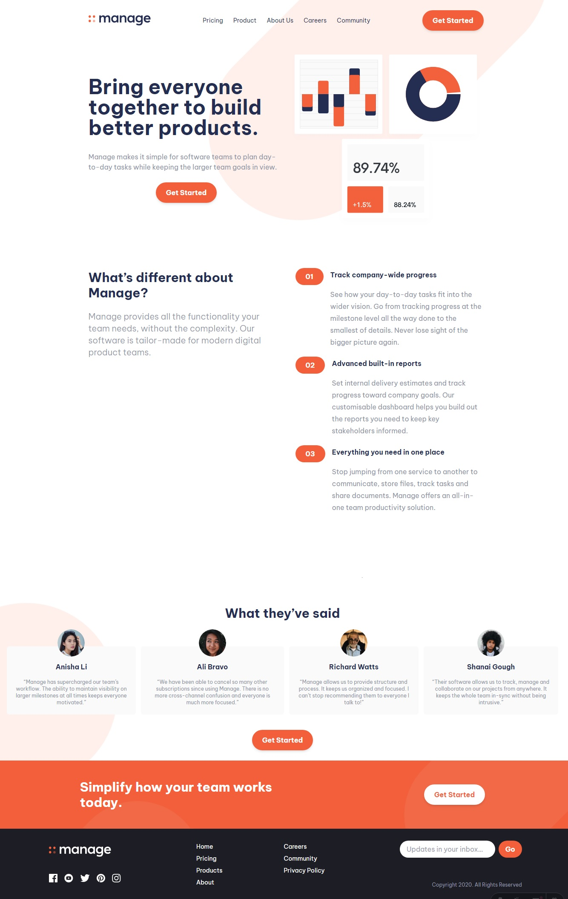
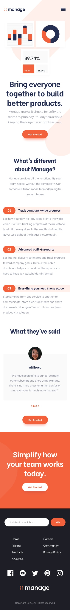

# Frontend Mentor - Manage landing page solution

This is a solution to the [Manage landing page challenge on Frontend Mentor](https://www.frontendmentor.io/challenges/manage-landing-page-SLXqC6P5). Frontend Mentor challenges help you improve your coding skills by building realistic projects. 

## Table of contents

- [Overview](#overview)
  - [The challenge](#the-challenge)
  - [Screenshot](#screenshot)

- [My process](#my-process)
  - [Built with](#built-with)
  - [What I learned](#what-i-learned)
- [Author](#author)

## Overview

### The challenge

Users should be able to:

- View the optimal layout for the site depending on their device's screen size
- See hover states for all interactive elements on the page
- See all testimonials in a horizontal slider

### Screenshot

## Desktop

## Mobile
nearly to this without the overlay in the mobile menu

### Links

## My process

### Built with
- [Astro](https://astro.build/) - JS library
- [React](https://react.dev/) - JS library for some components
- [Tailwind](https://tailwindcss.com/) - For styles
- [Swiper](https://swiperjs.com/) - For slide mobile testimonial

## Author
- Frontend Mentor - [@yourusername](https://www.frontendmentor.io/profile/yourusername)

